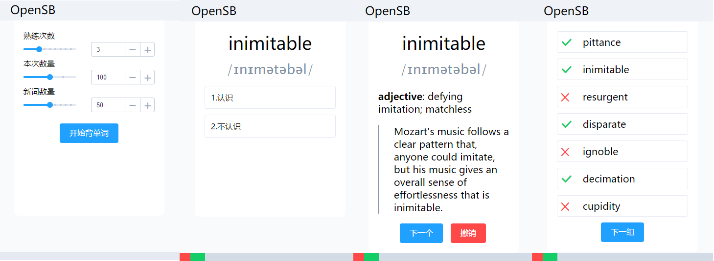

# OpenSB
An open-source implementation of ShanBay-like flashcards webview.



## Features
- Flashcards webview
- Responsive layout (PC/pad/phone)
- Word grouping
- Custom wordbook (Markdown supported)
- Memory and record

## Deploy
### Prepare a wordbook
The first thing needed is to prepare a wordbook. A wordbook is a JSON file: a `dict`, whose keys are words and values are respective word definitions (Markdown supported).
```json
{
  "inimitable": "**adjective**: defying imitation; matchless\n\n> Mozart's music follows a clear pattern that, anyone could imitate, but his music gives an overall sense of effortlessness that is inimitable.\n\n"
}
```
You could prepare a wordbook by yourself, or simply use an existing wordbook. If you are preparing for GRE test, I recommend you to check [another repo of mine](github.com/Czxck001/wordlists) to get several high-quality GRE wordbooks.

### Prepare the CMU Pronouncing Dictionary
OpenSB is able to show the pronounciation of words, by adopting [the CMU Pronouncing Dictionary](http://www.speech.cs.cmu.edu/cgi-bin/cmudict). To enable this feature you need to download the CMUDict file first (the latest version is 0.7b).
```bash
~/opensb $ wget http://svn.code.sf.net/p/cmusphinx/code/trunk/cmudict/cmudict-0.7b
```
By default, OpenSB will check `cmudict-0.7b` path. If the CMUDict file exists, the pronounciation will be adopted. If the file is not there, the feature will be turned off.

Moreover, you can use `-cmu` flag to specify the path of the CMUDict file.

### Start a server
```bash
python3 server.py -wb your_wordbook.json
```
and then access `localhost:8081`.

### Customization
#### Database
OpenSB adopt an SQLite database to store your reviewing record. By default, OpenSB will create a database at `memory.db` and bind it. Still, you can choose another path of database, or use an existing database, by specifying `-db` parameter.

```
python3 server.py -wb your_wordbook.json -db new_memory.db
```
